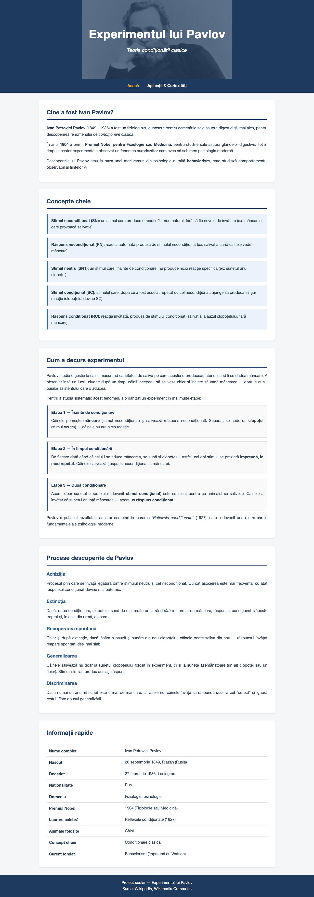
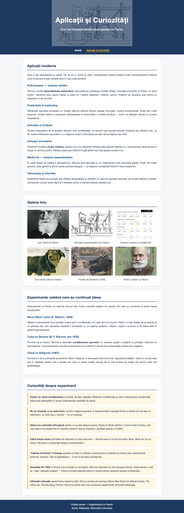

# LUCRARE DE ATESTAT

## Informatică

---

**Tema:** Experimentul lui Pavlov — pagină web

**Elev:** Martinovici Ioana Alexandra

**Clasa:** a XII-a B

**Profesor coordonator:** Prof. Soare Daniela

**Liceul:** Colegiul Național Spiru Haret București

**An școlar:** 2025 - 2026

---

## Cuprins

1. Argument
2. Pagina principală — index.html
   - 2.1. Codul sursă
   - 2.2. Explicația codului
3. Pagina de aplicații — atractii.html
   - 3.1. Codul sursă
   - 3.2. Explicația codului
4. Fișierul de stil — stil.css
   - 4.1. Codul sursă
   - 4.2. Explicația codului
5. Concluzii
6. Bibliografie

---

## 1. Argument

Am ales ca temă pentru lucrarea de atestat realizarea unui site web despre
**experimentul lui Ivan Petrovici Pavlov**, unul dintre cele mai importante
experimente din istoria psihologiei. Pavlov a descoperit, la sfârșitul
secolului al XIX-lea, fenomenul numit *condiționare clasică* — felul în care
un organism poate învăța să asocieze doi stimuli și să reacționeze la unul
ca și cum ar fi celălalt.

Tema mi s-a părut interesantă pentru că face legătura între **biologie**,
**psihologie** și **comportament uman**: deși experimentul a fost făcut pe
câini, principiile descoperite explică multe lucruri din viața noastră de
zi cu zi — de la reclame, la teama de stomatolog sau la modul în care
reacționăm la notificările telefonului.

Realizarea unui site web mi-a permis să aplic cunoștințele de **HTML** și
**CSS** învățate în orele de informatică. Site-ul este împărțit în două
pagini: prima prezintă *teoria și experimentul*, iar a doua prezintă
*aplicațiile moderne și curiozitățile*.

---

## 2. Pagina principală — index.html

Această pagină este punctul de intrare în site și conține partea teoretică:
cine a fost Pavlov, conceptele de bază ale condiționării clasice, etapele
experimentului, alte procese descoperite, precum și un tabel cu informații
rapide despre savant.



### 2.1. Codul sursă

Codul complet este în fișierul `index.html` din proiect. Vezi versiunea
HTML/PDF/DOCX a documentației pentru listingul integral.

### 2.2. Explicația codului

**Antetul documentului (head).** În secțiunea `<head>` sunt setate
informațiile pe care browserul le folosește pentru afișare:
- `<meta charset="UTF-8">` — codificarea de caractere, necesară pentru
  diacritice (ă, â, î, ș, ț).
- `<meta name="viewport">` — face pagina să arate bine și pe telefoane.
- `<title>` — titlul tab-ului din browser.
- `<link rel="stylesheet" href="stil.css">` — leagă pagina de fișierul cu
  stiluri.
- Un bloc `<style>` cu o regulă specifică acestei pagini, pentru imaginea
  de fundal a antetului (portretul lui Pavlov).

**Structura semantică a corpului paginii.** Pagina folosește elemente
**semantice** din HTML5, care descriu rolul fiecărei zone:
- `<header>` — antetul mare cu titlul și subtitlul, peste imagine.
- `<nav>` — bara de navigare. Link-ul paginii curente are clasa `activ`.
- `<main>` — conținutul principal.
- `<section>` — fiecare zonă tematică (despre, concepte, experiment, etc.).
- `<footer>` — subsolul.

**Secțiunile de conținut.** Pagina conține **cinci secțiuni**:
1. *„Cine a fost Ivan Pavlov?"* — biografie scurtă, premiul Nobel din 1904,
   legătura cu behaviorismul.
2. *„Concepte cheie"* — cinci definiții esențiale (stimul / răspuns
   necondiționat, neutru, condiționat). Fiecare e pusă într-o cutie cu
   clasa `.concept`.
3. *„Cum a decurs experimentul"* — cele trei etape (înainte / în timpul /
   după condiționare), în cutii cu clasa `.etapa`.
4. *„Procese descoperite de Pavlov"* — achiziția, extincția, recuperarea
   spontană, generalizarea, discriminarea.
5. *„Informații rapide"* — un tabel HTML cu date biografice.

**Elemente de marcaj folosite.** Pe parcursul paginii am folosit:
- `<strong>` — pentru cuvintele importante;
- `<em>` — pentru italic (titluri de cărți, expresii străine);
- `<table>`, `<tr>`, `<td>` — pentru tabelul de informații;
- `<div class="...">` — pentru cutiile speciale (concept, etapă).

---

## 3. Pagina de aplicații — atractii.html

A doua pagină a site-ului prezintă **aplicațiile practice** ale teoriei lui
Pavlov, o galerie foto, alte experimente celebre care au pornit de la
descoperirea lui și o serie de curiozități. Folosește același fișier de
stil ca prima pagină.



### 3.1. Codul sursă

Codul complet este în fișierul `atractii.html`. Vezi versiunea HTML/PDF/DOCX
a documentației pentru listingul integral.

### 3.2. Explicația codului

**Diferențe față de prima pagină.** Structura generală e foarte asemănătoare
cu cea de la `index.html` (aceleași elemente semantice, același fișier de
stil). Diferențele sunt:
- imaginea de fundal a antetului — una cu Pavlov în laborator;
- în meniu, clasa `activ` este pe link-ul „Aplicații & Curiozități";
- conținutul este complet diferit (aplicații, galerie, experimente
  derivate, curiozități).

**Secțiunile paginii:**
1. *„Aplicații moderne"* — șase domenii: psihoterapie, publicitate,
   educație, dresaj, medicină, tehnologie.
2. *„Galerie foto"* — șase imagini relevante puse într-un grid CSS care se
   adaptează automat la lățimea ecranului.
3. *„Experimente celebre care au continuat ideea"* — Micul Albert
   (Watson), Cutia lui Skinner, Câinii lui Seligman.
4. *„Curiozități despre experiment"* — șapte fapte mai puțin cunoscute, în
   cutii cu clasa `.curiozitate`.

**Galeria de imagini.** Construită cu un `<div class="galerie">` care
conține mai multe `<figure>`. Fiecare figură are o imagine și o legendă
(`<figcaption>`). Aspectul (mai multe coloane) e dat de regulile din
`stil.css`.

**Atribute de accesibilitate.** Fiecare imagine are atributul `alt` cu
descrierea conținutului. Acest text apare dacă imaginea nu se încarcă și
e citit de cititoarele de ecran.

---

## 4. Fișierul de stil — stil.css

Acest fișier conține toate regulile de stilizare aplicate site-ului. Este
folosit de ambele pagini HTML, ceea ce înseamnă că o singură modificare
aici se aplică automat pe tot site-ul.

### 4.1. Codul sursă

Codul complet este în fișierul `stil.css`. Vezi versiunea HTML/PDF/DOCX
a documentației pentru listingul integral.

### 4.2. Explicația codului

**Resetul inițial și stilurile generale.** Selectorul `*` anulează
marginile și padding-ul implicite ale browserului și activează
`box-sizing: border-box`. Pe `body` sunt setate fontul (Helvetica Neue,
sans-serif), culoarea textului și culoarea de fundal a paginii.

**Paleta de culori.** Inspirată din mediul academic / științific, cu un
accent cald pentru cutiile de curiozități:

| Culoare | Cod hex | Utilizare |
|---------|---------|-----------|
| Albastru închis | `#1f3a5f` | meniu, titluri, subsol, antet de tabel |
| Albastru mediu | `#2c5d8f` | subtitluri (h3), bara cutiei „concept" |
| Chihlimbar | `#e8a93b` | accent cald, link-ul activ, cutia „curiozitate" |
| Gri-deschis | `#f4f6f8` | fundalul paginii |
| Bleu pal | `#eaf2fb` | fundalul cutiei „concept" |
| Crem cald | `#fff7e6` | fundalul cutiei „curiozitate" |

**Antetul și navigarea.** `header` are `background-size: contain` (aspect
fit — imaginea se vede întreagă, fără tăiere). Spațiul rămas e umplut cu
albastru. Peste imagine e un gradient semitransparent care întunecă
imaginea, ca textul alb să fie lizibil. `nav` are `position: sticky;
top: 0`, deci meniul rămâne lipit sus când utilizatorul derulează pagina.

**Cutii speciale.** Trei tipuri de cutii cu fundal colorat și o bară
laterală groasă pe stânga (`border-left`):
- `.concept` — bleu pal, pentru definițiile termenilor;
- `.etapa` — gri foarte deschis, pentru pașii experimentului;
- `.curiozitate` — crem cald, pentru fapte interesante.

**Galeria — CSS Grid.** Galeria foto folosește **CSS Grid**, care
aranjează automat imaginile într-un număr potrivit de coloane:

```css
.galerie {
    display: grid;
    grid-template-columns: repeat(auto-fit, minmax(250px, 1fr));
    gap: 15px;
}
```

Funcția `repeat(auto-fit, minmax(250px, 1fr))` înseamnă: „umple linia cu
cât mai multe coloane care au cel puțin 250px lățime". Pe un ecran lat
vom vedea 4 imagini pe rând, iar pe telefon doar una sau două.

**Design responsive.** Un bloc `@media (max-width: 600px)` se activează
doar pe ecranele mici (telefoane). Acolo titlul antetului devine mai mic,
iar link-urile din meniu se așază unul sub altul.

---

## 5. Concluzii

Realizarea acestui proiect a fost o experiență utilă din mai multe puncte
de vedere:

- Mi-a permis să aplic în practică cunoștințele de **HTML** și **CSS**
  acumulate în orele de informatică.
- Am învățat să separ structura (HTML) de aspect (CSS), folosind un singur
  fișier de stil pentru ambele pagini.
- Am descoperit conceptul de **design responsive** și am exersat
  *media queries*, foarte importante astăzi când majoritatea oamenilor
  folosesc telefonul pentru a accesa internetul.
- Am exersat folosirea elementelor **semantice** din HTML5 (`<header>`,
  `<nav>`, `<main>`, `<section>`, `<footer>`).
- Tema mi-a permis să aprofundez și un subiect interesant din **psihologie**
  — experimentul lui Pavlov și implicațiile lui în viața de zi cu zi.

Pe viitor, proiectul ar putea fi îmbunătățit prin:
- adăugarea unei pagini de **quiz** care să verifice înțelegerea
  conceptelor (cu JavaScript);
- integrarea unei **animații** care să arate vizual cele trei etape ale
  experimentului;
- traducerea site-ului și în alte limbi (engleză, franceză).

---

## 6. Bibliografie

1. **Wikipedia** — articolul despre Ivan Pavlov:
   https://ro.wikipedia.org/wiki/Ivan_Pavlov

2. **Wikipedia** — Classical conditioning (engleză):
   https://en.wikipedia.org/wiki/Classical_conditioning

3. **Wikimedia Commons** — sursa imaginilor folosite:
   https://commons.wikimedia.org/

4. **MDN Web Docs** — documentația oficială pentru HTML și CSS:
   https://developer.mozilla.org/

5. **W3Schools** — tutoriale HTML și CSS:
   https://www.w3schools.com/

6. Manualul de Informatică pentru clasa a XII-a.

7. Manualul de Psihologie pentru clasa a X-a.
